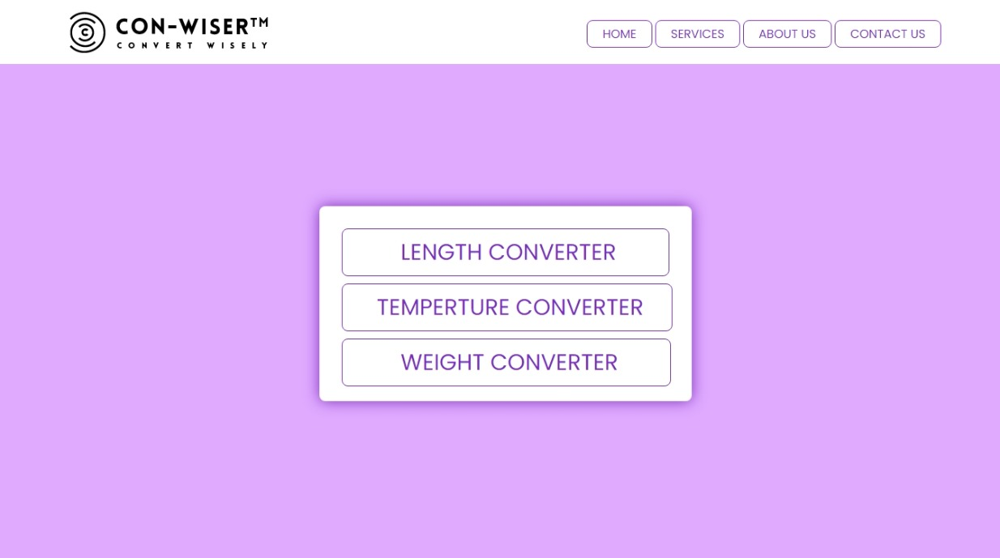
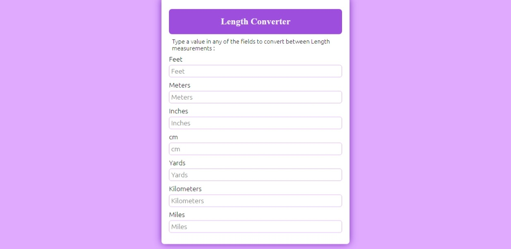
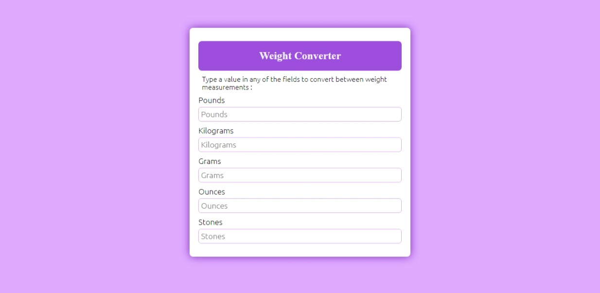
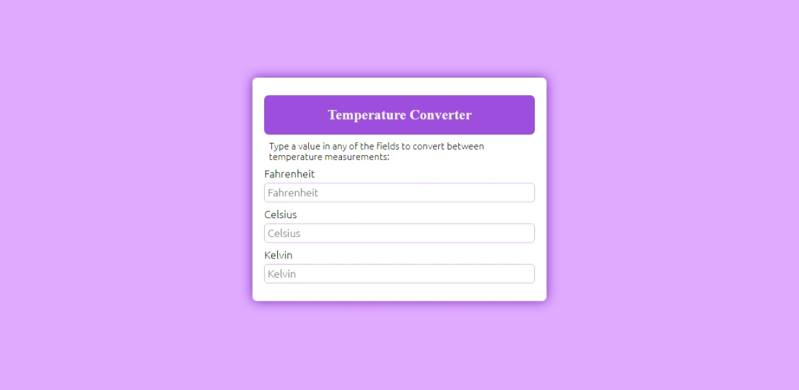

# Con-Wiser

Welcome to Con-Wiser! This web application provides a set of calculators to convert various units into different categories, including length, weight, and temperature. Developed in-house, these calculators aim to make unit conversions quick and straightforward. The project incorporates open-source JavaScript components under various open-source licenses to enhance functionality and user experience.

## 📊 Features

- **Length Converter:** Easily convert between different length units such as feet, inches, centimetres, meters, kilometres, yards, and miles.
  
- **Weight Converter:** Convert weights seamlessly with units like kilograms, pounds, ounces, and stones.

- **Temperature Converter:** Swiftly switch between Kelvin, Celsius, and Fahrenheit to meet your temperature conversion needs.

## 🚀 How to Use

1. Choose the calculator category (Length, Weight, Temperature).
2. Select the source unit.
3. Input the value you want to convert.
4. View the instant conversion result.

## 📷 Screenshots

*Website's Home Page*

*Services Page*

*Length Converter in action.*

*Weight Converter in action.*

*Temperature Converter in action.*

## 🔧 Technologies Used

- HTML5, CSS3 for structure and styling.
- JavaScript for dynamic functionality.
- Open-source JavaScript components under various licenses.

## 📚 Formulas and Equations

More than 90% of the calculators are based on well-known formulas or equations from textbooks. This ensures accuracy and reliability in the conversion results. Some of the supported units include Miles, Fahrenheit, Stones, Ounces, and many more.

## 🤝 Contributions

Contributions and suggestions are welcome! If you have ideas for improvements or would like to add new features, please follow the guidelines in the [CONTRIBUTING](CONTRIBUTING.md) file.

## 📬 Contact

- For inquiries or feedback, contact us at [anshulpadiyar2002@gmail.com](mailto:anshulpadiyar2002@gmail.com).
